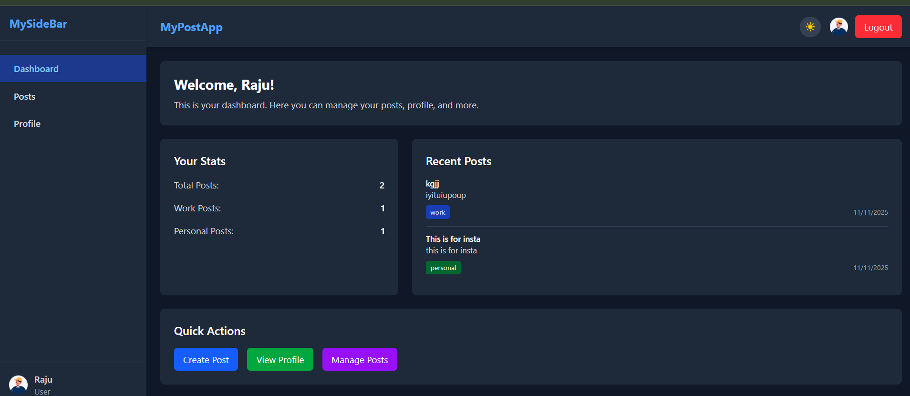
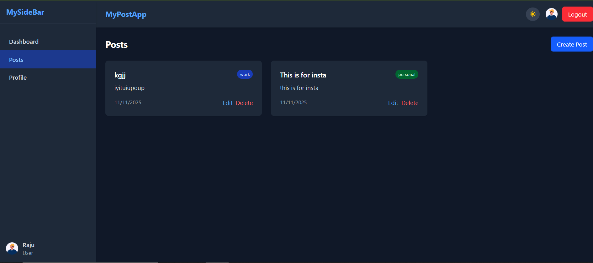
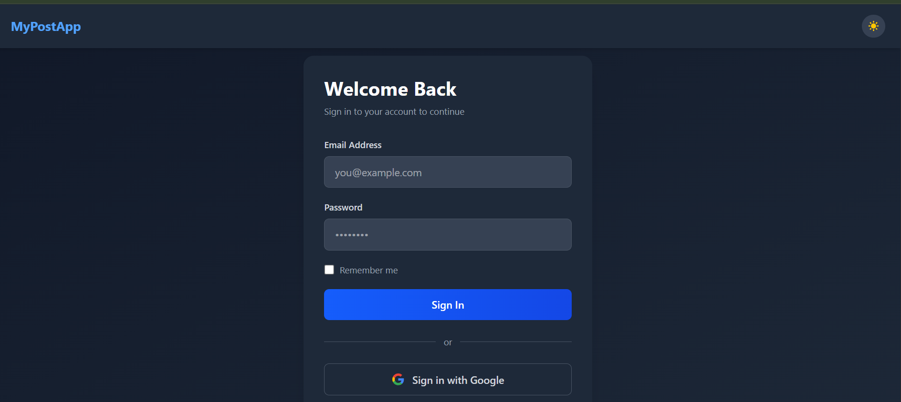
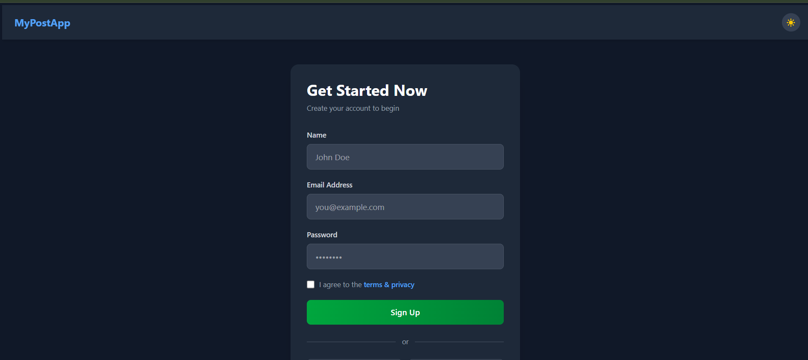
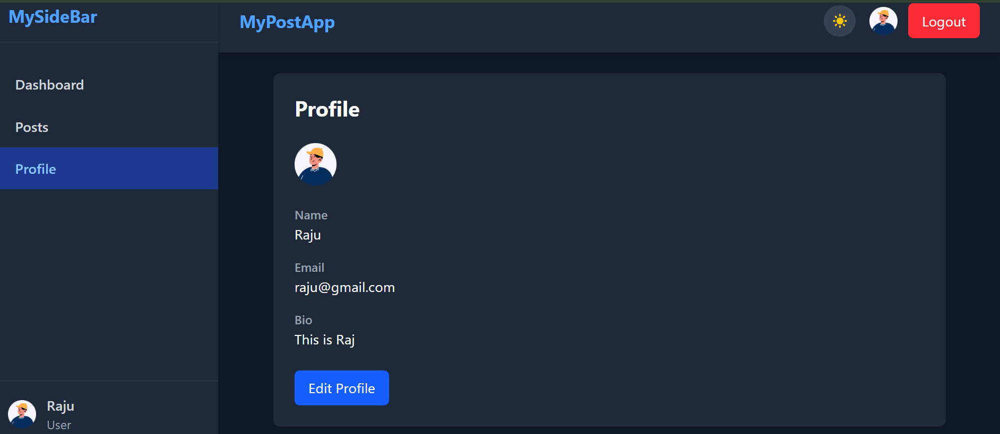
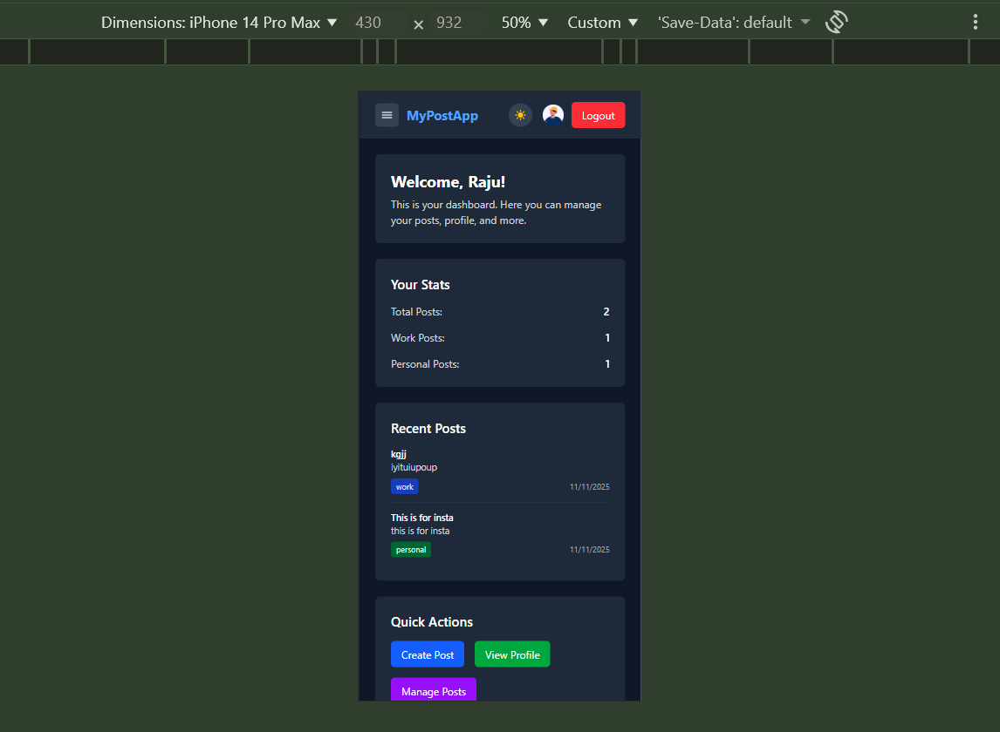
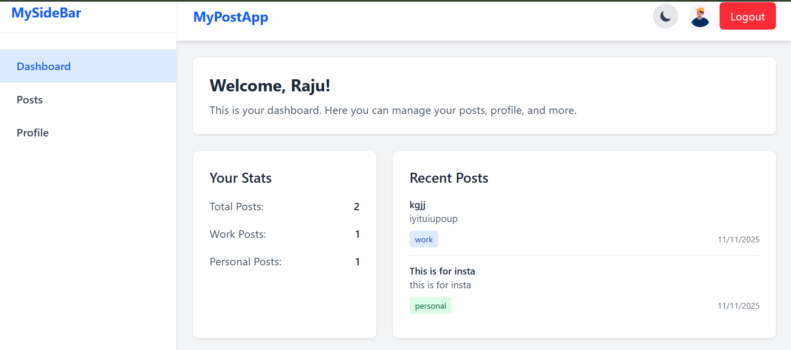

## MYTaskAPP

---

## Table of contents

- [Screenshots](#screenshots)
- [Features](#features)
- [Tech stack](#tech-stack)
- [Getting started](#getting-started)
- [Development scripts](#development-scripts)
- [Environment variables](#environment-variables)
- [Project structure](#project-structure)
- [Contributing](#contributing)
- [License](#license)

---

## Screenshots

Below are selected screenshots from the running application (files are in the `screenshots/` directory).

### Web / Dashboard

*Overview and analytics panel.*

### Posts / Main View

*List of posts with create/edit actions.*

### Authentication

*Login screen with form validation.*

### Register

*New user registration flow.*

### Profile

*User profile and settings.*

### Mobile Responsive

*Responsive layout for phone-sized screens.*

### Theme (Light)

*Theme toggle — light mode.*

---

## Features

- Responsive, accessible React UI
- Authentication (register, login) with token-based sessions
- CRUD operations for posts
- Role-based access control for admin/user routes
- Centralized state management via context stores
- Input validation and server-side request validation

## Tech stack

- Frontend: React, Vite
- Backend: Node.js, Express
- Database: MongoDB (Mongoose)
- Styling: CSS / (project may include Tailwind or custom CSS)

---

## Getting started

Prerequisites

- Node.js 16+ (recommended)
- npm or yarn

Quick start (run locally)

1. Install dependencies for client and server:

```bash
# from repository root
cd client
npm install

cd ../server
npm install
```

2. Create a `.env` file for the server (see [Environment variables](#environment-variables)).

3. Start both servers (use two terminals):

```bash
# In one terminal (client)
cd client
npm run dev

# In the other terminal (server)
cd server
npm run dev
```

Open http://localhost:5173 (client Vite default) or the port printed by your dev server.

## Development scripts

Check `client/package.json` and `server/package.json` for the currently available scripts. Typical scripts:

- `npm run dev` — start development server
- `npm start` — start production server (when built)
- `npm run build` — build production assets

---

## Environment variables

Create a `.env` in `server/` with the following (example):

```
PORT=5000
MONGODB_URI=mongodb://localhost:27017/mytaskapp
JWT_SECRET=your_jwt_secret_here
```

Adjust values to match your environment.

---

## Project structure (high level)

- `client/` — React front-end (Vite)
- `server/` — Express API server
- `screenshots/` — example screenshots used in this README

Refer to the repository root for the full structure.

---

## Contributing

Contributions are welcome. Please follow these steps:

1. Fork the repo
2. Create a feature branch
3. Open a pull request with a clear description of changes

---

## License

This project is provided under the MIT License. See the `LICENSE` file for details.

---

If you'd like, I can also:

- Add a small preview GIF or optimized thumbnails in `screenshots/`.
- Create a `docs/` folder with step-by-step deployment notes.

